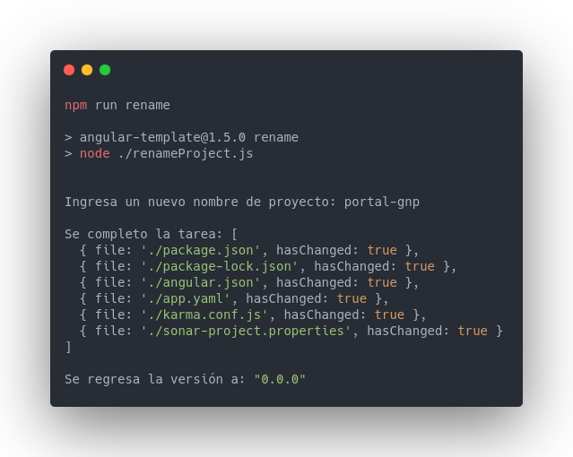
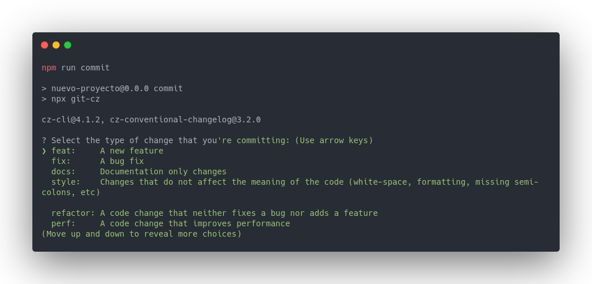
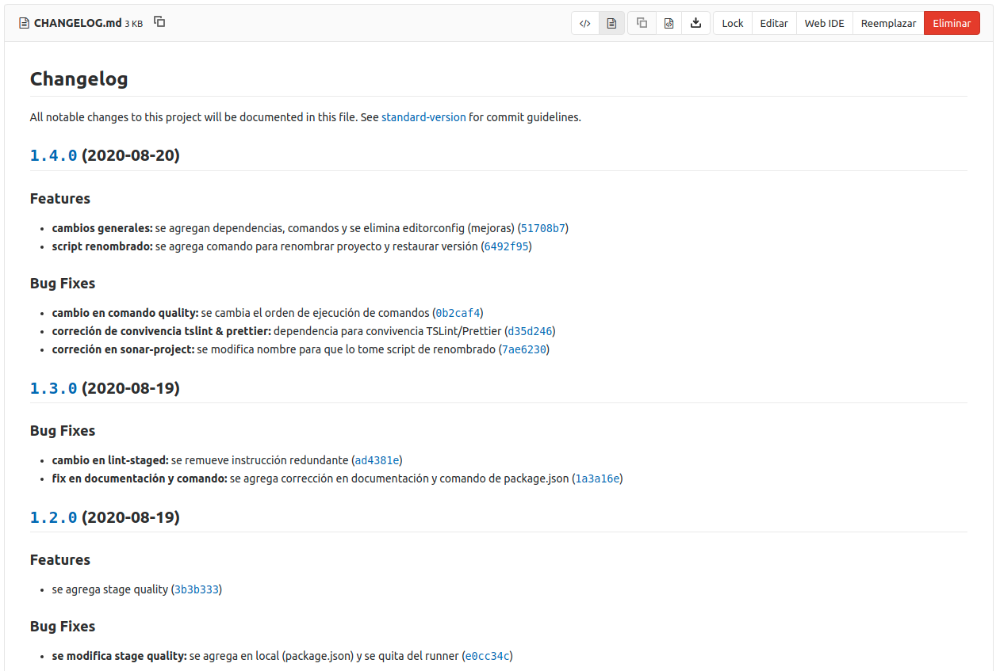

# [](https://www.gnp.com.mx/) Angular Template GNP

Este proyecto está enfocado a ser una guía base que permita homologar las tecnologías usadas dentro del ecosistema angular y también tener configuradas las tareas de integración continua necesarias para el proyecto.

Cuando inicies tu proyecto, reemplaza este texto de tal manera que describas el objetivo del mismo.

## Contenido

- [Arquitectura Aplicativa](#arquitectura-de-la-aplicación)
- [Requisitos Previos](#requisitos-previos)
  - [Instalación de Node](#instalación-de-node)
  - [Instalación de CLI Angular](#instalar-cli-angular)
  - [Instalación de IDE](#instalar-ide)
  - [Instalación de Extensiones](#extensiones)
- [Instalación de la Aplicación](#instalación-de-la-aplicación)
  - [Instalación de Dependencias](#instalación-de-dependencias)
  - [Inicialización de la Aplicación](#inicialización-de-la-aplicación)
- [Versionamiento Automático](#versionamiento-automático)
- [Forma de trabajo](#forma-de-trabajo)
- [Integración Continua (CI)](#pipeline-ci)
- [Despliegue](#despliegue)
- [Contribuidores](#contribuidores)
- [Referencias](#referencias)

---

## Arquitectura de la aplicación

| Dependencia        | Versión mínima | Versión recomendada |
| ------------------ | -------------- |---------------------|
| @angular/cli       |    10.0.0      |        10.0.0       |
| @angular/core      |    10.0.0      |        10.0.0       |
| node               |    10.0.0      |        12.0.0 LTS   |
| npm                |    5.0.0       |        6.14.7       |


Nota: Si tu proyecto usa otras dependencias, reemplaza la información previa y borra esta nota.

## Requisitos Previos

Para poder instalar esta aplicación se deberá cumplir con los siguientes pre requisitos:

1. Tener instalada la versión **LTS de Node** o alguna superarior, así como algún gestor de
   dependencias para node, recomendamos **NPM**. 
2. Tener instalado de forma global **Angular CLI**
3. Tener instalado **Java 8** o superior para poder ejecutar sonarqube. Recomendamos el uso de **Java 11**

A continuación se dejan instrucciones para cumplir con los pre requisitos.

### Instalación de Node

A continuación le dejamos las referencias recomendadas para la instalación de node y npm.

1. [Instalación de node y npm (varios SO)](https://nodejs.org/es/download/)
2. [Instalación de node y npm (ubuntu)](https://www.digitalocean.com/community/tutorials/como-instalar-node-js-en-ubuntu-18-04-es)


### Instalar CLI Angular

Instalación de forma global (puede requerir permisos de root)

```sh
npm install -g @angular/cli
```

### Instalar IDE

Para el desarrollo de Angular recomendamos como IDE principal **Visual Studio Code**. Es necesario desarrollar en VS Code para mantener homologadas las extensiones y el estilo de código que se usa en el proyecto.

[Instalar Visual Studio Code](https://code.visualstudio.com/#alt-downloads)


### Extensiones

Necesarias:

- [Prettier](https://marketplace.visualstudio.com/items?itemName=esbenp.prettier-vscode)
- [SonarLint](https://marketplace.visualstudio.com/items?itemName=SonarSource.sonarlint-vscode)
- [TSLint](https://marketplace.visualstudio.com/items?itemName=ms-vscode.vscode-typescript-tslint-plugin)
- [SonarLint](https://marketplace.visualstudio.com/items?itemName=sonarsource.sonarlint-vscode)

Opcionales:

- [Angular Snippets](https://marketplace.visualstudio.com/items?itemName=johnpapa.Angular2)
- [GitLens](https://marketplace.visualstudio.com/items?itemName=eamodio.gitlens)


## Instalación de la aplicación

Para poder ejecutar la aplicación de forma local (en modo desarrollo) es necesario seguir los siguientes pasos:

### Instalación de dependencias

Si ya ha cumplido con los requisitos previos deberá poder ejecutar el siguiente
comando para instalar las dependencias necesarias usadas en la aplicación:

```sh
npm install
```

### Inicialización de la aplicación

Para iniciar la aplicación se ejecuta el siguiente comando:


```sh
ng serve -o
```

Si tiene ocupado el puerto 4200 es necesario que pase pase el argumento --port seguido del número de puerto en que desea levantar la aplicación, si requiere iniciar la aplicación con una configuración diferente y personalizada, consulte la documentación de [angular](https://angular.io/). 

### Renombrar Plantilla

Hemos generado un comando para que inicialices la plantilla con los datos de tu proyecto, este comando cambiara el nombre del proyecto y le pondrá la versión 0.0.0.



Nota: Si el parametro hasChanged es **false**, significa que no se modifico nada dentro del archivo en cuestión. El script funcionará si se esta ejecutando desde [plantilla de GNP](http://git.gnp.mx/arquitectura/gnp_angularui_template) (angular-template) si copia desde otro proyecto basado en este y quiere renombrar, modificar el parámetro **actualName** en script [rename](./renameProject.js).

### Versionamiento automático 

A continuación se indica la nomenclatura para los branches :hash:

- fix-branchName (0.0.X)
- hotfix-branchName (0.0.X)
- minor-branchName (0.0.X)
- patch-branchName (0.0.X)
- feature-branchName (0.X.0)
- major-branchName (X.0.0)

### Forma de trabajo

0. Obtener todos los cambios que pudo haber sufrido nuestro código derivados de alguna integración 
   ```
   git pull
   ```

1. Crear un nuevo branch desde **master** con la nomenclatura definida con el comando
   ```
   git checkout -b feature-branchName
   ```

2. Una vez teniendo el código que queremos integrar, agregamos los archivos que deseemos a nuestro commit
   ```
   git add fileName
   ```

3. Ejecutar el comando 
   ```
   npm run commit
   ```

   Inmediatamente se abrira un formulario para ayudarle a realizar un standard commit.
   
   
   Esto permitirá que es ejecuten en el servidor los hooks de Husky (Prettier, tslint y construcción de código) y generará un CHANGELOG (Archivo de publicación de cambios) de forma automática.

   


   **Es muy importante que no se modifiquen estas tareas, de lo contrario, el servidor regresará un error**

4. Enviar el código al repositorio remoto
   ```
   git push
   ```

5. Generar un **merge request** en la interfaz gráfica de git.gnp.mx

6. Realizar una inspección de código (code review) y asegurarnos de que no existan conflictos en el código

7. Hacer el merge del branch que creamos con master. Automáticamente se dispararán las tareas de auto versionamiento


## Pipeline CI

**Quality Stage**.- Se verifica la calidad del código. Se ejecutan TSLint y el análisis de SonarQube (El reporte de cobertura esta configurado pero pendiente de ejecución en runner). La cobertura se puede generar siempre que se desee en forma local con el comando 


```sh
npm run quality
```

**Build Stage**.- Instalación de dependencias, construcción de código.

**Version Stage**.- Determina la versión únicamente al integrar con master.

**Deploy Stage**.- Ejecuta el shell de automic para desplegar.


## Despliegue

Para desplegar es necesario seguir los siguientes pasos:

1. Modificar en el app.yaml la información del proyecto y configuraciones opcionales independientes de cada proyecto en caso de necesitar una.

Nota: El app.yaml que contiene este proyecto es una base en la cual las rutas son gestionadas por el router de angular, del mismo modo se tiene una configuración incial que permite algunos archivos estáticos ser renderizados. Si necesita algo más especifico, leer la documentación y configurar. Esta configuración es general y debería de funcionar para la mayoria de proyectos.

2. Proveer los archivos app.yaml y environment.prod.ts al equipo de infraestructura para cada ambiente (QA, UAT, PRO).
    Estos son los archivos que se reemplazarán por ambiente

3. Solicitar al equipo de infraestructura la configuración de automic en su proyecto GCP y ejecutar los siguientes comandos
```
   npm install && ng build --prod 
   gcloud app deploy
```
4. Para verificar la versión instalada de la aplicación es necesario presionar la tecla F12 dentro del navegador Google Chrome y seleccionar la pestaña "console".

## Contribuidores

Es importante llenar esta sección, ya que si alguien le da mantenimiento a tu aplicación y no le entiende a tu código, con esta infromación podrá saber a quien contactar en caso de dudas.

| Nombre             | Contacto                           |
| ------------------ | ---------------------------------- |
| Desarrollador 1    | desarrollador1@gnp.com.mx          |
| Desarrollador 2    | desarrollador2@gnp.com.mx          |

## Referencias

Si usaste alguna dependencia que no se maneja de inicio por fa coloca el enlace a la documentación en que se basaron para su implementación.

- [Documentación de angular](https://angular.io/)
- [Documentación de node](https://nodejs.org/en/)

  Extra:

- [Documentación angular fire / firebase en angular](https://github.com/angular/angularfire)
- [Versionamiento Semántico / conventional-commits](https://www.conventionalcommits.org/en/v1.0.0/)
- [Gitflow / Flujos de trabajo en GIT](https://www.atlassian.com/git/tutorials/comparing-workflows/gitflow-workflow)

